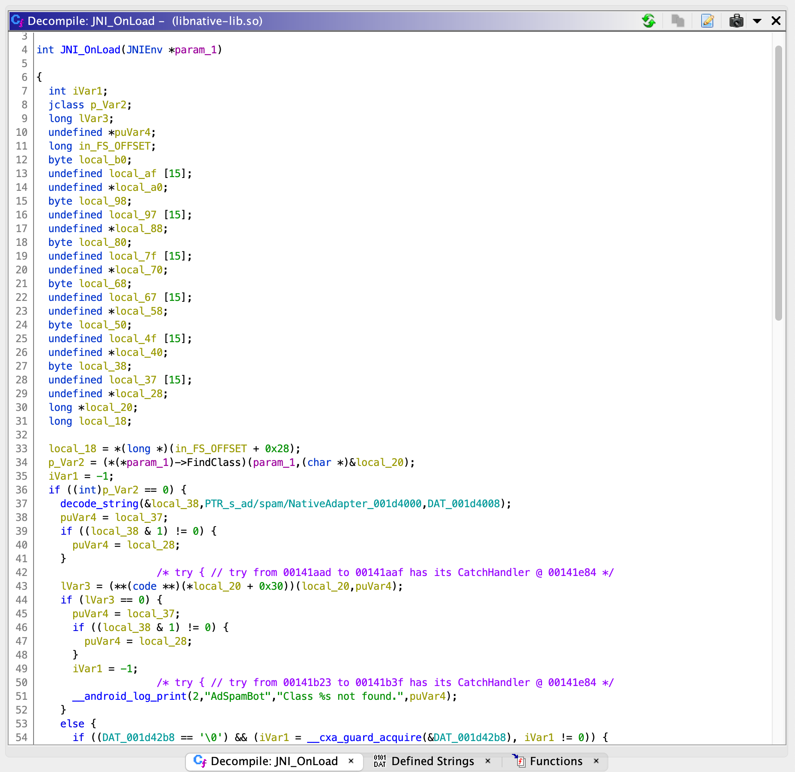
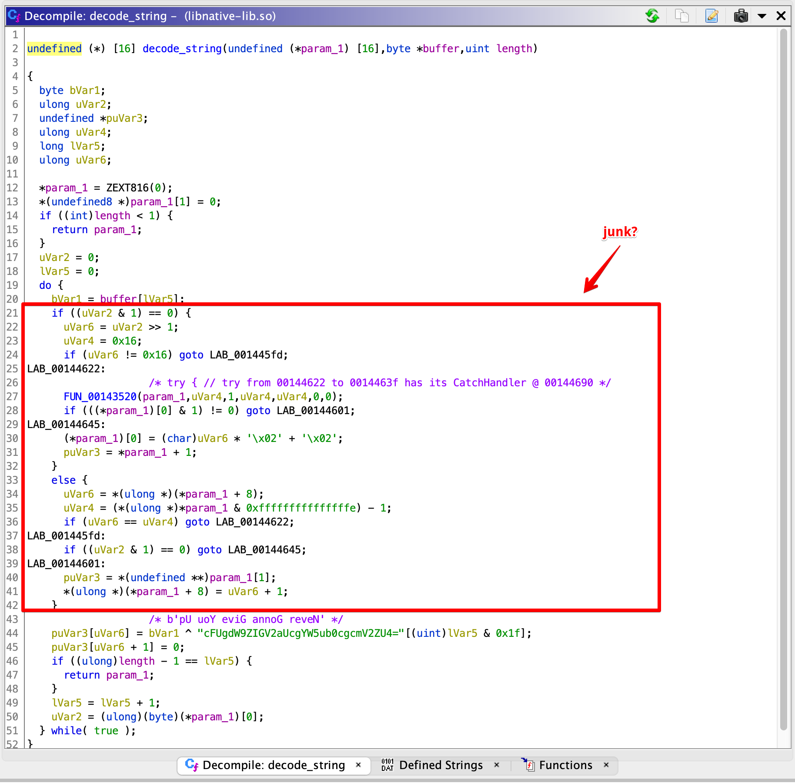
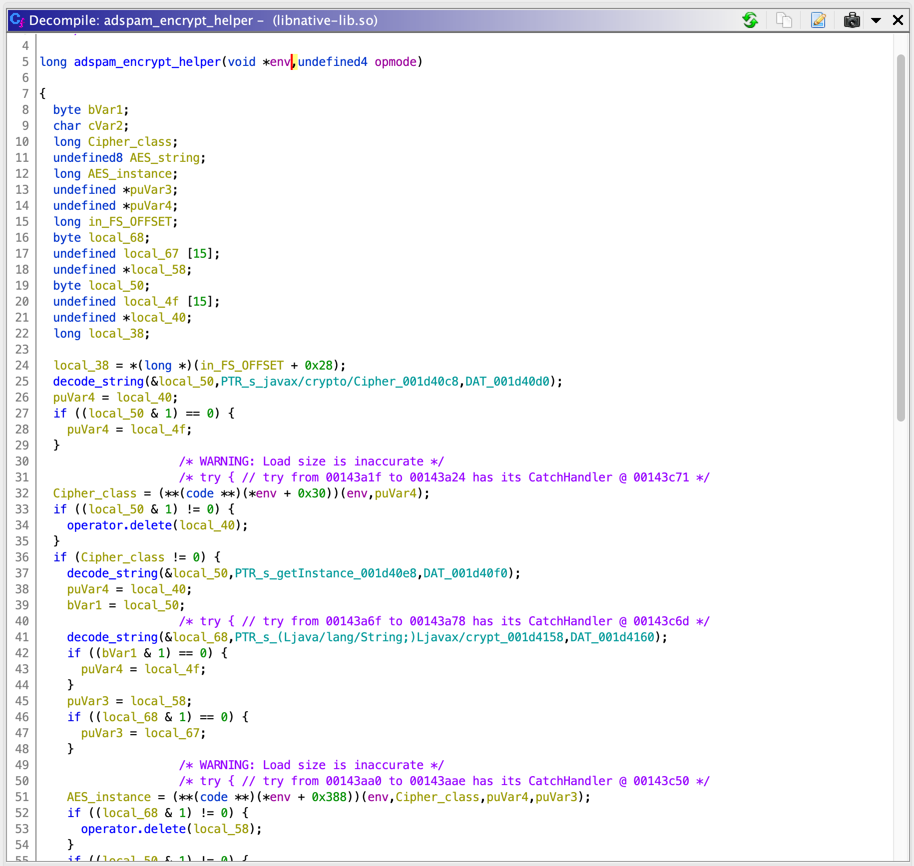
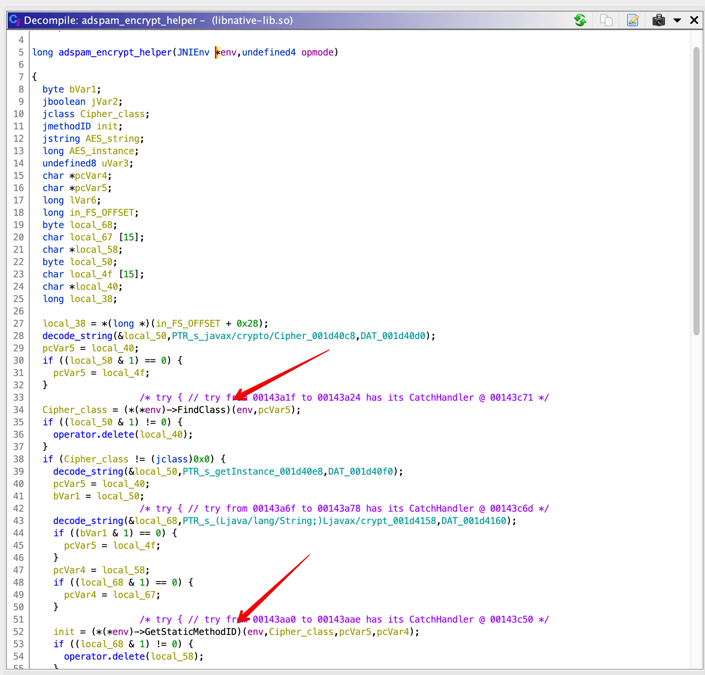

# ADSPAM

>We've intercepted this demo build of a new ad spam bot, see if you can find anything interesting.

[Attachment](https://github.com/google/google-ctf/blob/master/2021/quals/rev-adspam/Bot/app/release/app-release.apk) `adspam.2021.ctfcompetition.com 1337`

## Analysis

Another one I didn't solve during the CTF, but it turns out to not be too complex. The challenge provides an Android app (`app-release.apk`) and a server with a custom protocol. The challenge employs C code using the Java Native Interface (JNI) with some obfuscated strings. I've had some brief experience with JNI, so once I recognized what was going on and looked up some disassembly guides the challenge was straightforward in any of x86, x86_64 or ARM. Finally, there is a short bit of connecting to the server and some basic cryptographic flaws which allow you to present a request as an "admin" and retrieve the flag.

## Decompilation

[jadx](https://github.com/skylot/jadx) is my go-to decompiler for Android apps. Installing and running it reconstructs the app to Java classes and extracts all resources. There are a couple ways to start the challenge here including:

* `grep`-ing for "adspam" -- this doesn't occur in any `.java` files, but does show up in the `libnative-lib.so` binaries and a `strings.xml` resource
* connecting to the server -- if you connect and send any text you get back what seems to be a base64 encoded and encrypted string which could lead you to the next item
* searching for `encrypt` or `decrypt` -- this shows up in the `sources/a/a/f.java` file and the `NativeAdapter` class (`sources/ad/spam/NativeAdapter.java`) which points to the `native-lib` library.
* installing the app in an Android virtual device -- the app seems to run, but there is no noticable network traffic (over TCP/1337)

Eventually each of these leads to one of the `libnative-lib.so` binaries. I loaded up the x86_64 one in Ghidra, found the "AdSpamBot" string referenced in several locations with the only named one being `JNI_OnLoad`.

## JNI Reversing

Searching around for Android reversing got me [this helpful guide](https://github.com/maddiestone/AndroidAppRE/blob/master/reversing_native_libs.md). This guide describes the Java Native Interface (JNI) and how C-functions are initialized and then called directly from Java code (in the Android app). The short version is that `JNI_OnLoad` is the default function which is called by a `System.loadLibrary` or `System.load` initialization call.



The decompilation of my chosen library looks roughly like the one above. This disassembly already has several functions labeled, but the first thing to notice is that there aren't any strings defined that you might expect from a function expected to setup function exports. The `decode_string` function was labeled by me after the fact but disassembles as below. Reading through the decompiled C code has a bunch of strange instructions with some pointer arithmetic and various `goto` statements. My initial reaction to this is that there is some funny business with code obfuscation here, and if you ignore the block highlighted below, then the result is a simple function which XORs a string with the base64 string `"cFUgdW9ZIGV2aUcgYW5ub0cgcmV2ZU4="`. This seems like a basic string obfuscation method and if you decode the base64 and read it backwards you get a all-too-common Rick Astley reference.



I wrote a Python function to automate the string obfuscation (below), and ran it on several memory segments used as arguments to the labeled `decode_string` function.

```python
def decode_string(st):
	if type(st) == bytes:
		st1 = st
	else:
		st1 = binascii.unhexlify(st)
	st2 = b'cFUgdW9ZIGV2aUcgYW5ub0cgcmV2ZU4='
	return bytes(st1[i]^st2[i%32] for i in range(len(st1)))
```

I then copy/pasted over the existing bytes in my binary's data section to make it more readable and doing so shows you that the actual strings in the function are sensible values like "ad/spam/NativeAdapter", "transform", "oktorun", "encrypt", "decrypt", and "declicstr" which all match the function names in `NativeAdapter.java`. It appears that this function is setting up an export for each of these functions, and in fact there are corresponding function pointers for these exported functions in the same `JNI_OnLoad` function. This gives names for each of the functions referenced from Java code so I went ahead and named them for easier disassembly later.

## AdSpam "decrypt"

While I could have continued with any of the newly labeled functions, I started with the "decrypt" one as it seemed like the most likely to lead to a better understanding of the challenge. This function seems to call two functions - one which seems like a "helper" function and another which is shorter. Starting with the "helper" one (labeled `adspam_encrypt_helper`), you notice that the first parameter seems to have many virtual function calls.



Referring back to the JNI reversing guide above provides some helpful input here. By default Ghidra install doesn't have a lot of the JNI data types defined, but that guide helpfully points out [this jni_all.gdt file](https://github.com/Ayrx/JNIAnalyzer/blob/master/JNIAnalyzer/data/jni_all.gdt) which can be loaded into Ghidra to define types like `JNIEnv*`. Doing this, and then setting the type of the first argument to `JNIEnv*` gives a much clearer picture with function names like "FindClass", "GetStaticMethodID", "NewStringUTF", "GetMethodID", etc.



After some tweaking of the function, some variable renaming, and looking at the strings awhile you notice that the function seems to lookup functions in standard Java classes and then invoke them with various parameters. Looking at the decoded strings here alone gives a clear picture of what is going on. They are:

```
javax/crypto/Cipher
getInstance
(Ljava/lang/String;)Ljavax/crypto/Cipher;
AES
init
```

A second function deep only called after several successful response code has a similar structure with strings like

```
javax/crypto/spec/SecretKeySpec
<init>
([BLjava/lang/String;)V
eaW~IFhnvlIoneLl
AES
```

You might be able to guess from those alone what's going on (which may be the reason for the string obfuscation in the first place). Roughly speaking, I assumed that this "helper" function does roughly:

```java
spec = new SecretKeySpec("eaW~IFhnvlIoneLl", "AES")
return new Cipher.getInstance("AES").init(opmode, spec) // opmode is param_2
```

Returning to the original `adspam_decrypt` function, we see that this helper was called with `opmode==2`. Additionally, the same structure here for the other function turns out to be roughly:

```java
return cipher.doFinal(data)
```

All in all, this function seems to do a straightforward AES decryption with a fixed key of "eaW~IFhnvlIoneLl". Furthermore, the "encrypt" export is nearly identical with the only change being `opmode==1`. Strangely, the cipher suite here doesn't reference a block cipher mode (like CBC, CTR, GCM, ECB, etc), but a little trial-and-error later showed that it was only using the most basic ECB mode.

## Blindly Decrypting

From this point, I had a decryption primitive and started blindly trying to decrypt things. Turning our attention to the strings returned from the server, the now-decrypted responses for random strings are the following:

```
b'{"cmd": -1, "data": "Incorrect padding"}\x08\x08\x08\x08\x08\x08\x08\x08'
b'{"cmd": -1, "data": "Data must be aligned to block boundary in ECB mode"}\x07\x07\x07\x07\x07\x07\x07'
```

And then sending a payload such as `encrypt(b'{}\x0e\x0e\x0e\x0e\x0e\x0e\x0e\x0e\x0e\x0e\x0e\x0e\x0e\x0e')` gives a response of

```
b'{"cmd": -1, "data": "\'license\'"}'
```

This confirms the encryption key is correct, but clearly to understand this protocol more analysis on the binary needs to be done.

## Lincense Decryption

Looking through the references to the NativeAdapter functions, the `a/a/f.java` class, there is a function which reads a license file from an app resource, decrypts lines individually with the `declicstr` function, and then formulates a JSON structure to encrypt and send to the server. The license file can be found in the `resources/res/raw/lic` file. Trying the same fixed-key ECB AES decryption on the lines of this seems to give nonsense, so we give the `declicstr` JNI function the same treatment we gave to `decrypt`.

Again, this function has a bunch of obfuscated strings, some function lookups and then invocation of those functions. Skipping to the Java pseudocode we have the following

```java
// adspam_x509_key is a DER-encoded RSA public key extracted from the binary (using Ghidra) to a file
object_ks = X509EncodedKeySpec.<init>(adspam_x509_key)
object_kf = KeyFactory.GetInstance("RSA")
object_pub = object_kf.generatePublic(object_ks)
object_rsa = Crypto.getInstance("RSA")
object_rsa.init(mode=2,object_pub) // 2 == DECRYPT_MODE or PRIVATE_KEY
```

Again, the usage of only "RSA" here is a bit confusing since no padding is specified, but it turns out that this is just a basic RSA with no padding whatsoever.

Running this scheme on the given license, we see that the decrypted lines, when rendered in hex give

```
0xb313333
0x375f6861
0x636b6572
0x24373938
0x62376464
0x342d6431
0x37312d31
0x3165622d
0x35313439
0x2d316661
0x35393630
0x33636564
0x35013000
```

This can be reconstructed to the bytes `b'\x0b1337_hacker$798b7dd4-d171-11eb-5149-1fa59603ced5\x010\x00'`. Reading through the Java code (and some functions in other classes), it seems like the format of this string is a length byte following by ASCII characters. When divided up, this gives `"1337_hacker"` for the "name", `"798b7dd4-d171-11eb-5149-1fa59603ced5"` for some UUID, and then `"0"` for "is_admin".

## Server Interaction

Using what we've identified so far - the decrypted license, the individual components, and an "is_admin" value - the expected request can be submitted to the server. I wrote a script to do this and get the following output:

```
send: encrypt(b'{"name": "1337_hacker$", "is_admin": 1, "device_info": {"os_version": "??", "api_level": 30, "device": "??"}, "license": "QIknTsIjeUEF9yJjeZ/kPPfTlSm8vzMU4LWjzfSXvN+OSqBu3iNgZJgeW7fc8oltH9MprO9nI8vxgsjO/VA4t7YuNm16a7elPVAHqD4dXtzngnZPpsbek3Rc/We/WQ5YxXHgUt7YJ6tcd4wH3fhduC9tl/E5elwJL/YAcbD4mT8=::o9kjqYWCBKMgodl1JvDiscUeRjh9Ip9HcC7tHskoYqNQfAPE0XvSAKBSOFgleNHzVY9BVkfxmutgn/kVXUs3yl/qAurc4jokg0eA/v3flnnkWxqTOh4vv0yfr7PGXqwHk4qUFK1SldZ4VsLhd8PAb0aHj22E5b4U5jeJ16z187E=::gpDbCb0BmUZfdKVIZgF08lQ80K9SeUsRadZG+UUjE7wI1NRZ1evLk2GQ3sqskGHFKlPg8cTR2Xy69WedNu4QLboOWm/w13ocOvHwCoiQ1ZdmibgnhMQBznqpjpBnL083YMRYskcUX68R2PFaXY3taV7MoG1DyQWFRfdr/CnLyS8=::ZBLhwMu0DbgpUANm2ukYldrppJERiH1Tgp02CRB5I4dDP8n4+ZCv33ScspELtgAKHhiwIVksQVsnwDLsQRi6nqq9nrIwqSHMR0TwOe6UKTpAegbH53FXtriopPHfLuI2M45SzJ88GFjXy7wfOOjwDYe4KKO9KU8+LGD15Au73EM=::Hygv+bTtsnI9IBf44GkvoF38r3g5zBB7uyYT7PTlbjhCdgYRwRayutI3vY+n66xM7GOFgUFVIBI5+OBDnvazLNttjGomPED/OXlImndWvrZxYcaKaE3vYGPezorV0xwPahGGq/DWafPKdYxLxwICq1GXKYNAckCZIqfpGbJRRwg=::GARMZAX7fQN7i7Wnp4J6HxMTLe9+VM/wGJs+zN6b9IOmynh2gIkGjmssfOA9KdYydqBLEOJymayH8HeyrtInhhQNR3el8A5n8GMEMkyF1gUFAiSEPyhNeWWOj2IAHGNNwccmF7QywdfOUGjsTNFbrW6Yl5QLLAmMbA95qF0IERk=::YWlx8Cok1x/3ZsW9JKIsKj9UpBaCNkXSPiVXUrNX1IDZE0B8iNr3iliOr90TW0BvsIaFEwvDTlcESXJ8kLc3iZq0fm1lgujfM7Z156VdxEPjr9LplcEZ9ZVhYGNtVyGIRcouUDJHu3FVfXQ1XesaNlNHOb50hADprsw3RnTAGbU=::I3dsx2vSfXxZ1/QlMbwYPRFEZBtOuB8qLEY8cqFVtYjMluNWSkbHAYB+kwCBEv3yuoOjkdQEfqq4pS+K0ka1+pFDyss8sSbV3OiZdpRf40SS/pZxw2duJr9uDd1DdX8mST7fdjqj0V1a2ZBMpqaEI2gFlCwzXlfZBC47LKNiM+8=::ow7r5VJMGfSf0odNKxzBpUtSJdj8gHdt+Z7Xu54MAdsnUParSjrtRI4yJYzcW4toOFmDdSs5SERR289yohYI5hHSWLElv/44O+g4M08F5qpwCmOp5otW32qRG1RnhqR95evH44nOyK24UnpvWlebNwVhniSu4A7znjluGRrao/U=::TeGqGWv8ZmsY/rFq1puW9N+01TWTKJm8qzUuY/7JUCPDJ1AR6Y3XsPb73FuSVHPL63sjiuCTiKTRSUDzBE0VBfo59rtOKI05k64Jrz88nODD7BiK7ssacsOr2dAFGQKgBaWV2jitSAdxtCmh9sDpYsfs0/vXBBfVLqfVZDfAVGQ=::Al3QWY+nNFoLezt+rSdbWmqp7iZ+rR9pnM35IJNZ63bLQeM3CUvULVczhrM3toXNLCY7xmAT4jg+u0uDAjanaKMB+T1Tmym7aaCqwCfHYVFn5nw+tw54e13CLxj7OO+e847+XH8DtK/BiA+n03vPnt/cEDPvIM59sPsjHThJvpk=::VOGr60qxiO1r0YlKnrIWbQu7UhBmtBeNw2NDQnoNU3H1mjVEs/ji3AYuEGc2HGKINByq7Mpb4mWKD2oH5ii/UZDpxbzCFlJrjvjEG25c9Hhf2fiQHvRXmJd8iA8YdffBii3csCjaydLFSX6Vn7XPg+/PF/TdM1zUiLTJZX4LXRw=::ELL9maLDpdmmEgaT76qtw9IugtaQX2r7V7QVqMKXQcbwq7o0dvaO3+yMt6m5K5Milm4JSNwX/810YUaoAsHNuaIavuLRsxbP3b6KnKxaKz3EDgyhye2en3U1EZouiLljBB0bKz8rAtyGdolWDdNoKjvLhv7x2edc05HQZOt3aiA=::"}\x0e\x0e\x0e\x0e\x0e\x0e\x0e\x0e\x0e\x0e\x0e\x0e\x0e\x0e')
recv: b'+EBt8Nfv2gpgUbeAFwLCcZAgZRLOE6HPAb+0hSE5ig9b1vGxH1Y9kVzOI9qgLhfMTStCb6jynsZxHvwkLJC3uQ==\n'
decrypted: b'{"cmd": 2, "data": "https://youtu.be/z6WsEXpJ5DU"}\x0e\x0e\x0e\x0e\x0e\x0e\x0e\x0e\x0e\x0e\x0e\x0e\x0e\x0e'
```

Clearly the decrypted contents aren't quite the flag so we need a little bit more. The submission above also shows that you can't just change the `is_admin` value to a non-zero value to finish the challenge. Looking at the decrypted contents again, we can see that the final block - `0x35013000` - has the last byte of the UUID, the length `0x01`, and then the string `"0" == 0x30`. There is another block with the value `0x35393630` which contains the same last character of the UUID, but then a length byte of `0x39`. This is rather long, but it turns out that we can just append a lot digit-based text to the submitted license to spoof a non-zero "is_admin" value in the UUID to finally get the flag. This submission is given below, and the full script used for analysis included in this directory.

```
send: encrypt(b'{"name": "1337_hacker$", "is_admin": 1, "device_info": {"os_version": "??", "api_level": 30, "device": "??"}, "license": "QIknTsIjeUEF9yJjeZ/kPPfTlSm8vzMU4LWjzfSXvN+OSqBu3iNgZJgeW7fc8oltH9MprO9nI8vxgsjO/VA4t7YuNm16a7elPVAHqD4dXtzngnZPpsbek3Rc/We/WQ5YxXHgUt7YJ6tcd4wH3fhduC9tl/E5elwJL/YAcbD4mT8=::o9kjqYWCBKMgodl1JvDiscUeRjh9Ip9HcC7tHskoYqNQfAPE0XvSAKBSOFgleNHzVY9BVkfxmutgn/kVXUs3yl/qAurc4jokg0eA/v3flnnkWxqTOh4vv0yfr7PGXqwHk4qUFK1SldZ4VsLhd8PAb0aHj22E5b4U5jeJ16z187E=::gpDbCb0BmUZfdKVIZgF08lQ80K9SeUsRadZG+UUjE7wI1NRZ1evLk2GQ3sqskGHFKlPg8cTR2Xy69WedNu4QLboOWm/w13ocOvHwCoiQ1ZdmibgnhMQBznqpjpBnL083YMRYskcUX68R2PFaXY3taV7MoG1DyQWFRfdr/CnLyS8=::ZBLhwMu0DbgpUANm2ukYldrppJERiH1Tgp02CRB5I4dDP8n4+ZCv33ScspELtgAKHhiwIVksQVsnwDLsQRi6nqq9nrIwqSHMR0TwOe6UKTpAegbH53FXtriopPHfLuI2M45SzJ88GFjXy7wfOOjwDYe4KKO9KU8+LGD15Au73EM=::Hygv+bTtsnI9IBf44GkvoF38r3g5zBB7uyYT7PTlbjhCdgYRwRayutI3vY+n66xM7GOFgUFVIBI5+OBDnvazLNttjGomPED/OXlImndWvrZxYcaKaE3vYGPezorV0xwPahGGq/DWafPKdYxLxwICq1GXKYNAckCZIqfpGbJRRwg=::GARMZAX7fQN7i7Wnp4J6HxMTLe9+VM/wGJs+zN6b9IOmynh2gIkGjmssfOA9KdYydqBLEOJymayH8HeyrtInhhQNR3el8A5n8GMEMkyF1gUFAiSEPyhNeWWOj2IAHGNNwccmF7QywdfOUGjsTNFbrW6Yl5QLLAmMbA95qF0IERk=::YWlx8Cok1x/3ZsW9JKIsKj9UpBaCNkXSPiVXUrNX1IDZE0B8iNr3iliOr90TW0BvsIaFEwvDTlcESXJ8kLc3iZq0fm1lgujfM7Z156VdxEPjr9LplcEZ9ZVhYGNtVyGIRcouUDJHu3FVfXQ1XesaNlNHOb50hADprsw3RnTAGbU=::I3dsx2vSfXxZ1/QlMbwYPRFEZBtOuB8qLEY8cqFVtYjMluNWSkbHAYB+kwCBEv3yuoOjkdQEfqq4pS+K0ka1+pFDyss8sSbV3OiZdpRf40SS/pZxw2duJr9uDd1DdX8mST7fdjqj0V1a2ZBMpqaEI2gFlCwzXlfZBC47LKNiM+8=::ow7r5VJMGfSf0odNKxzBpUtSJdj8gHdt+Z7Xu54MAdsnUParSjrtRI4yJYzcW4toOFmDdSs5SERR289yohYI5hHSWLElv/44O+g4M08F5qpwCmOp5otW32qRG1RnhqR95evH44nOyK24UnpvWlebNwVhniSu4A7znjluGRrao/U=::TeGqGWv8ZmsY/rFq1puW9N+01TWTKJm8qzUuY/7JUCPDJ1AR6Y3XsPb73FuSVHPL63sjiuCTiKTRSUDzBE0VBfo59rtOKI05k64Jrz88nODD7BiK7ssacsOr2dAFGQKgBaWV2jitSAdxtCmh9sDpYsfs0/vXBBfVLqfVZDfAVGQ=::Al3QWY+nNFoLezt+rSdbWmqp7iZ+rR9pnM35IJNZ63bLQeM3CUvULVczhrM3toXNLCY7xmAT4jg+u0uDAjanaKMB+T1Tmym7aaCqwCfHYVFn5nw+tw54e13CLxj7OO+e847+XH8DtK/BiA+n03vPnt/cEDPvIM59sPsjHThJvpk=::VOGr60qxiO1r0YlKnrIWbQu7UhBmtBeNw2NDQnoNU3H1mjVEs/ji3AYuEGc2HGKINByq7Mpb4mWKD2oH5ii/UZDpxbzCFlJrjvjEG25c9Hhf2fiQHvRXmJd8iA8YdffBii3csCjaydLFSX6Vn7XPg+/PF/TdM1zUiLTJZX4LXRw=::ow7r5VJMGfSf0odNKxzBpUtSJdj8gHdt+Z7Xu54MAdsnUParSjrtRI4yJYzcW4toOFmDdSs5SERR289yohYI5hHSWLElv/44O+g4M08F5qpwCmOp5otW32qRG1RnhqR95evH44nOyK24UnpvWlebNwVhniSu4A7znjluGRrao/U=::ow7r5VJMGfSf0odNKxzBpUtSJdj8gHdt+Z7Xu54MAdsnUParSjrtRI4yJYzcW4toOFmDdSs5SERR289yohYI5hHSWLElv/44O+g4M08F5qpwCmOp5otW32qRG1RnhqR95evH44nOyK24UnpvWlebNwVhniSu4A7znjluGRrao/U=::ow7r5VJMGfSf0odNKxzBpUtSJdj8gHdt+Z7Xu54MAdsnUParSjrtRI4yJYzcW4toOFmDdSs5SERR289yohYI5hHSWLElv/44O+g4M08F5qpwCmOp5otW32qRG1RnhqR95evH44nOyK24UnpvWlebNwVhniSu4A7znjluGRrao/U=::ow7r5VJMGfSf0odNKxzBpUtSJdj8gHdt+Z7Xu54MAdsnUParSjrtRI4yJYzcW4toOFmDdSs5SERR289yohYI5hHSWLElv/44O+g4M08F5qpwCmOp5otW32qRG1RnhqR95evH44nOyK24UnpvWlebNwVhniSu4A7znjluGRrao/U=::ow7r5VJMGfSf0odNKxzBpUtSJdj8gHdt+Z7Xu54MAdsnUParSjrtRI4yJYzcW4toOFmDdSs5SERR289yohYI5hHSWLElv/44O+g4M08F5qpwCmOp5otW32qRG1RnhqR95evH44nOyK24UnpvWlebNwVhniSu4A7znjluGRrao/U=::ow7r5VJMGfSf0odNKxzBpUtSJdj8gHdt+Z7Xu54MAdsnUParSjrtRI4yJYzcW4toOFmDdSs5SERR289yohYI5hHSWLElv/44O+g4M08F5qpwCmOp5otW32qRG1RnhqR95evH44nOyK24UnpvWlebNwVhniSu4A7znjluGRrao/U=::ow7r5VJMGfSf0odNKxzBpUtSJdj8gHdt+Z7Xu54MAdsnUParSjrtRI4yJYzcW4toOFmDdSs5SERR289yohYI5hHSWLElv/44O+g4M08F5qpwCmOp5otW32qRG1RnhqR95evH44nOyK24UnpvWlebNwVhniSu4A7znjluGRrao/U=::ow7r5VJMGfSf0odNKxzBpUtSJdj8gHdt+Z7Xu54MAdsnUParSjrtRI4yJYzcW4toOFmDdSs5SERR289yohYI5hHSWLElv/44O+g4M08F5qpwCmOp5otW32qRG1RnhqR95evH44nOyK24UnpvWlebNwVhniSu4A7znjluGRrao/U=::ow7r5VJMGfSf0odNKxzBpUtSJdj8gHdt+Z7Xu54MAdsnUParSjrtRI4yJYzcW4toOFmDdSs5SERR289yohYI5hHSWLElv/44O+g4M08F5qpwCmOp5otW32qRG1RnhqR95evH44nOyK24UnpvWlebNwVhniSu4A7znjluGRrao/U=::ow7r5VJMGfSf0odNKxzBpUtSJdj8gHdt+Z7Xu54MAdsnUParSjrtRI4yJYzcW4toOFmDdSs5SERR289yohYI5hHSWLElv/44O+g4M08F5qpwCmOp5otW32qRG1RnhqR95evH44nOyK24UnpvWlebNwVhniSu4A7znjluGRrao/U=::ow7r5VJMGfSf0odNKxzBpUtSJdj8gHdt+Z7Xu54MAdsnUParSjrtRI4yJYzcW4toOFmDdSs5SERR289yohYI5hHSWLElv/44O+g4M08F5qpwCmOp5otW32qRG1RnhqR95evH44nOyK24UnpvWlebNwVhniSu4A7znjluGRrao/U=::ow7r5VJMGfSf0odNKxzBpUtSJdj8gHdt+Z7Xu54MAdsnUParSjrtRI4yJYzcW4toOFmDdSs5SERR289yohYI5hHSWLElv/44O+g4M08F5qpwCmOp5otW32qRG1RnhqR95evH44nOyK24UnpvWlebNwVhniSu4A7znjluGRrao/U=::ow7r5VJMGfSf0odNKxzBpUtSJdj8gHdt+Z7Xu54MAdsnUParSjrtRI4yJYzcW4toOFmDdSs5SERR289yohYI5hHSWLElv/44O+g4M08F5qpwCmOp5otW32qRG1RnhqR95evH44nOyK24UnpvWlebNwVhniSu4A7znjluGRrao/U=::"}\x06\x06\x06\x06\x06\x06')
recv: b'f54X7LW1ERp7BvsWf4ygiKhZJSl3LKN40NJXGuO8u7x8QndiHizV5pr+QB4ybsWF9yU8DR2WD9I+Z/N7uhl/M3Iw+uxjyVVU1Mr20/rb+6o=\n'
decrypted: b'{"cmd": 1, "data": "CTF{n0w_u_kn0w_h0w_n0t_t0_l1c3n53_ur_b0t}\\n"}\x0f\x0f\x0f\x0f\x0f\x0f\x0f\x0f\x0f\x0f\x0f\x0f\x0f\x0f\x0f'
```

